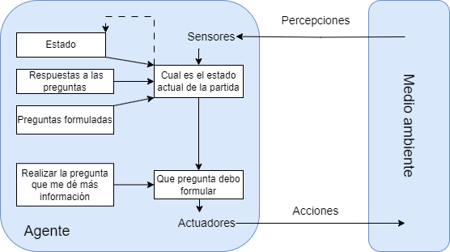

# quienesquien

## 1. Optimización vs Búsquedas

Por definición, en un problema de optimización se busca encontrar la mejor opción dentro de un grupo de opciones. En este caso, el juego "¿Quién es quién?" podría considerarse un problema de optimización, ya que se busca identificar a un personaje desconocido realizando el menor número de preguntas posibles. En este caso, las opciones podrían ser las características de los personajes y la mejor entre ellas sería la que más nos ayude a filtrar entre los personajes.

## 2. Entorno del agente

Contorno de tareas | Completamente/ Parcialmente Observable | Agentes | Determinista/ Estocastico | Episódico/ Secuencial  | Estático/ Dinamico | Discreto/ Continuo | Conocido/ Desconocido
:---: | :---: | :---: | :---: | :---: | :---: | :---: | :---: |
 ¿Quien es quien? | Totalmente/ Parcialmente | Multiagente | Determinista/ Estocastico | Secuencial | Estático |  Discreto |  Conocido |

 Explicación de las características elegidas:

- **Completamente/Parcialmente Observable**: Totalmente a la hora de hacer las preguntas, ya que el jugador puede ver todas las caracteristicas de los personajes. Parcialmente a la hora de predecir el personaje, ya que no sabemos el personaje elegido por el contrincante.

- **Agentes**: Multiagente, ya que el juego cuenta con dos jugadores.

- **Determinista/Estocastico**: Determinista a la hora de hacer preguntas, ya que cada pregunta sobre una característica tiene una respuesta específica que depende únicamente de las características de los personajes. Estocastico a la hora de predecir el personaje, ya que no podemos predecir el personaje del otro jugador de manera exacta hasta realizar multiples preguntas.

- **Episódico/Secuencial**: Secuencial, ya que las preguntas anteriores pueden influir en las preguntas posteriores.

- **Estático/Dinamico**: Estático, ya que el entorno no cambia cmientras el jugador esta pensando o formulando preguntas.

- **Discreto/Continuo**: Discreto, ya que  las acciones (hacer preguntas) y los estados (conjunto de posibles personajes) son claramente definidos y finitos.

- **Conocido/Desconocido**: Conocido, ya que tienes conocimiento sobre las reglas por las que se rige el juego.

## 3. Algoritmo

## 4. Estrutura del agente

El modelo elegido es el de agente reactivo basado en modelos. Este tipo de agente mantiene un modelo interno del mundo (en este caso, las posibles características de los personajes restantes) y toma decisiones basadas en este modelo.

## 5. Programación lógica

La programación lógica destaca por su capacidad para resolver problemas mediante la definición de reglas y hechos, lo cual es ideal para juegos de deducción como "¿Quién es quién?" donde se deben adivinar personajes a partir de sus características. En concreto la programación lógica permite manejar fácilmente las relaciones y restricciones entre los datos, haciendo posible determinar quién cumple con ciertas características de manera facil.

## 6. Base de datos Prolog

## Webgrafía y Bibliografía

- https://www.ncbi.nlm.nih.gov/pmc/articles/PMC7946196/

- Sharan, Kishori. Beginning Java 8 Fundamentals: Language Syntax, Arrays, Data Types, Objects, and Regular Expressions. Apress, 2014.
- Hurbans, Rishal. Grokking Artificial Intelligence Algorithms. Manning Publications Co, 2020.
- Russell, Peter. Artificial Intelligence : A Modern Approach, Global Edition. S.L., Pearson Education Limited, 2021.